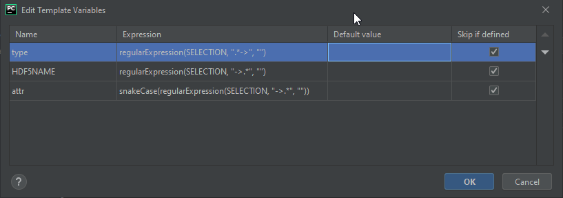

Extending the API
=================

To create a new api from this framework or modify an existing one, use the following classes from :any:`s100py.s1xx`
as well as the ones in :any:`s100py.s100`.
    - S1XX_Attributes_base for hdf5 groups with attributes, datasets and sub-groups.
    - S1XX_Dataset_base for datasets (numpy arrays).
    - S1XX_MetadataList_base for groups that have multiple occurrences using the S100 naming scheme (Group_NNN)

To make data members for one of the above classes, here is how to make a template in PyCharm to
speed creation:

    - File-Settings-Editor-LiveTemplates
    - Create a new template (hit the plus button on the side) and name it S102 and give it a description
      paste in the code below (@property lines)
    - Click the Edit Variables and for $attr$ under expression put: snakeCase(SELECTION)
      at the bottom is a line that says "applicable in" and has a hyperlinked word (define or change) -- click that and select Python

To use, highlight the camel case S102 attribute name and press ctrl-alt-J (or ctrl-alt-T) and select your S102 from the list
It will fill in the names and then put the cursor in the right place to specify the type

What it does:
    - take the selected text (name from the S102 doc) and:
    - make a read only property returning the S102 HDF5 attribute name
    - make a read/write property to contain the data
    - make a property to tell the type of the data
    - make a _create() function to make a default value for the attribute

Code to put in your live template ::

    $attr$_attribute_name = return "$SELECTION$"  #: HDF5 naming

    @property
    def $attr$(self) -> $type$:
        return self._attributes[self.$attr$_attribute_name]

    @$attr$.setter
    def $attr$(self, val: $type$):
        self._attributes[self.$attr$_attribute_name] = val

    @property
    def $attr$_type(self) -> Type[$type$]:
        return $type$

    def $attr$_create(self):
        """ Creates a blank, empty or zero value for $attr$"""
        self.$attr$ = self.$attr$_type()

For enumeration data types use this template which is very similar
    - Again, click the Edit Variables and for $attr$ under expression put: snakeCase(SELECTION)
      at the bottom is a line that says "applicable in" and has a hyperlinked word (define or change) -- click that and select Python
::

    $attr$_attribute_name = return "$SELECTION$"  #: HDF5 naming

    @property
    def $attr$(self) -> $type$:
        return self._attributes[self.$attr$_attribute_name]

    @$attr$.setter
    def $attr$(self, val: Union[int, str, $type$]):
        self.set_enum_attribute(val, self.$attr$_attribute_name, self.$attr$_type)

    @property
    def $attr$_type(self) -> Type[$type$]:
        return $type$

    def $attr$_create(self):
        """ Creates a value using the first item in the enumeration of $attr$"""
        self.$attr$ = list(self.$attr$_type)[0]

This template makes an attribute but specifies the type as well before you run it.
Put the HDF5 name from the S100+ spec first followed by an arrow (->) then the type.

Click the Edit Variables and:
    - for "type" under expression put: regularExpression(SELECTION, ".*->", "")
    - for "HDF5NAME" for expression put: regularExpression(SELECTION, "->.*", "")
    - for "attr" under expression put: snakeCase(regularExpression(SELECTION, "->.*", ""))
    - at the bottom is a line that says "applicable in" and has a hyperlinked word (define or change) -- click that and select Python

Types can be basic python types or custom created classes.

Ex:  eastBoundLongitude->float ::

    $attr$_attribute_name = return "$HDF5NAME$"  #: HDF5 naming

    @property
    def $attr$(self) -> $type$:
        return self._attributes[self.$attr$_attribute_name]

    @$attr$.setter
    def $attr$(self, val: $type$):
        self._attributes[self.$attr$_attribute_name] = val

    @property
    def $attr$_type(self) -> Type[$type$]:
        return $type$

    def $attr$_create(self):
        """ Creates a blank, empty or zero value for $attr$
        $SELECTION$
        """
        self.$attr$ = self.$attr$_type()

And finally a similar one for enumerations.
Same syntax or HDF5 name followed by the Enumeration name.

Click the Edit Variables and:
    - for "type" under expression put: regularExpression(SELECTION, ".*->", "")
    - for "HDF5NAME" for expression put: regularExpression(SELECTION, "->.*", "")
    - for "attr" under expression put: snakeCase(regularExpression(SELECTION, "->.*", ""))
    - at the bottom is a line that says "applicable in" and has a hyperlinked word (define or change) -- click that and select Python

If you used the enumeration 'MONTY' from the sample api, this would look like   dataName->MONTY ::

    $attr$_attribute_name = return "$HDF5NAME$"  #: HDF5 naming

    @property
    def $attr$(self) -> $type$:
        return self._attributes[self.$attr$_attribute_name]

    @$attr$.setter
    def $attr$(self, val: Union[int, str, $type$]):
        self.set_enum_attribute(val, self.$attr$_attribute_name, self.$attr$_type)

    @property
    def $attr$_type(self) -> Type[$type$]:
        return $type$

    def $attr$_create(self):
        """ Creates a blank, empty or zero value for $attr$
        $SELECTION$
        """
        self.$attr$ = list(self.$attr$_type)[0]

